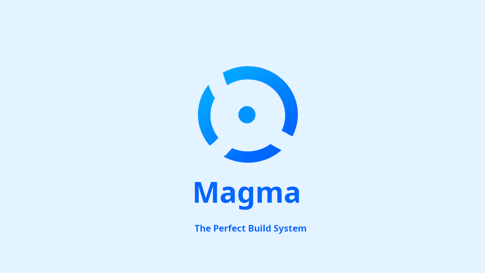

`Magma` is an Open-Source Cross-Platform Build System developed for Making C++ Projects with a lot of ease. `Magma` is the ease of use first and then for advanced uses, `Magma` is a self-hosted project it means that the project `Magma` was compiled using `Magma` it-self and also `Magma` is capable to any Complex Projects Like GUI projects also, It was tested with a basic gtkWindow Application and it was running fine. `Magma` was developed as a robust successor of the `Nautix-Build-System` which is definetly more easier to use as compared to `Magma` but is also less flexible as compared to `Magma` as the `Nautix-Build-System` heavily relies on pre-defined structured format where the keys/values pairs are used but also the file is sensitive to indentations, Where the `Magma` build system is having a more function based syntax where a dedicated `Lexical Annalyser` and `Intermediate Representation Parser` are used to compile your project and it uses a complex chain processes for transporting the `build.magma` file to the final system calls for making the projects and which is why these files are very flexible and can be written in any way needed.

With everything in mind `Magma` is also a fantastic project for learning purposes, Where the people who are intrested in how `Lexical Annalyser` and `Intermediate Representation Parser` works under the hood or just want to learn how **Compilers/Interpreters** works under the hood, Then the project `Magma` is a fantastic option to learn from. `Magma` is also completly independent means , No 3rd party library is needed to be downloaded and Unlike `CMake`; `Magma` don't relies on any other build system like `make`. It's completly self-dependent and was written from scratch with only **Standard C++ Library**.

*Note: Magma is Linux first and then for other operating systems*

## Installing Magma
`Magma` is very simple to install but you will need to compile the build system yourself. But don't worry the installation and compilation process are very very simple. Just follow the steps. 

### You Must Have These Things Installed In You System
 - git
 - GNU/GCC G++

### Getting the Magma
Use the following commands and make sure that you have `git` already been installed.

```bash
git clone https://github.com/darkyboys/magma
cd magma
ls
```

You must see the list of all the **files/directories** once ran the commands , If yes then continue next.
**If no then make sure that you have**
 - git
 - network access
 - basic binaries like cd or ls
 - on windows run dir instead of ls in cmd

### Compiling the Magma
Now Compiling the magma is very easy just you need to ensure that you have **GNU/GCC G++** already been installed in your system.

You can build the Magma in 2 ways:
 - Use a base Magma installation
 - Use GCC Directly

*Let's see what both means*

**Use a base Magma installation** : This means that you can build magma build system using magma itself as magma is capable for self-hosting, But for this you will need a base installation of magma itself. But don't worry because the magma base binaries can be obtained directly from `Releases` or it also directly comes within the repository itself inside the `example` directory with path `example/magma/` but this is only for Linux systems not for macos or windows , For these you must use GCC method instead.

**Use GCC Directly** : This is also an option but it's pretty long, And it's recommended to use the Base magma Installation process anytime when it is possible but if not then you can use this way, Specially if your Linux kernel is very outdated or very updated or you are not on Linux eg windows or mac then you only has this option. But you musr have GCC to be installed in your system.

*Commands*

#### Use a base Magma installation
For using this method make sure you are inside the magma repository (Cloned), And fire the following command.
```bash
example/magma
```
And you must see the `MAGMA VERSION x` on your console , note that x is the variable version of your MAGMA build. And now you can open the bin directory and you will find the `magma` binary and you can now paste it in your environment path for making it very accessible.

But if you got any error related to permissions then you must give the executable permission to the `example/magma` for compiling by the following command.

```bash
chmod +x example/magma
```

*Full command:*
```bash
chmod +x example/magma
example/magma
```


#### Use GCC Directly
For using this method make sure you are inside the magma repository (Cloned), And fire the following command.
```bash
mkdir bin
g++ src/main.cc -o bin/magma
bin/magma v
```

And you will have the magma binary inside the bin directory, And you can now place this binary to your environment path variable for making it very accessible.

*Note: You must follow the instructions carefully*

## How To Use Magma?
Using `Magma` is very very simple! Just create the `build.magma` file in your project and then you can use the `magma` command to compile your project from the `build.magma` file, Note that you will find the documentation of `build.magma` file inside the repository directory named as `docs.html` and you can launch it in any browser to see and documentation.

### shell64.magma
A `shell64.magma` is a file format introdued in `magma4` by ghgltggamer to allow magma to execute commands from a seperate file, This file contains commands in famr format as a `.sh` file would contain, And then `magma` runs all of these commands line by line.

**For Example:**
You want to build the project okay, But now also want to provide a shell script semlessly binds with magma to provide your app's install. Well you can make a install directory and add commands to the `install/shell64.magma` as per root directory and now you can say.
```bash
sudo magma install
```
And magma will read from `shell64.magma` or `build.magma` files.
You can also use `build.magma` with `run` function but then `shell64.magma` will do it seamlessly.


## Contributing ?
Please refer the <a href="CONTRIBUTING.md">CONTRIBUTING.md</a> file for guidelines.

## Thanks for Supporting.
 Copyright (c) ghgltggamer 2025 1/28/25 - 1/29/25